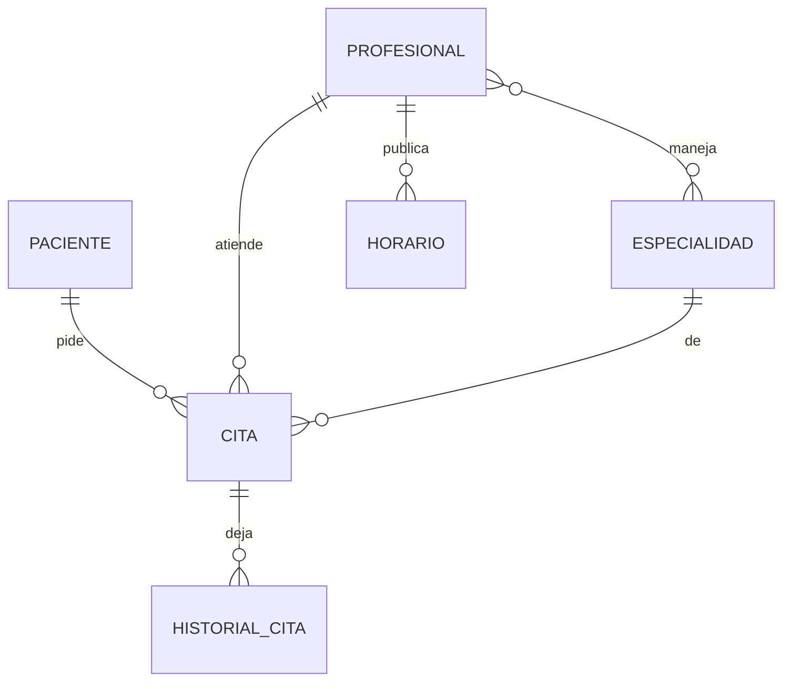

# Citas Médicas

Segunda actividad — backend, Scrum y base de datos  
Grupo: *(poner nombres)* · Uniminuto · Patrones

Nos enfocamos en gente que lo pasa mal con las apps de salud: **discapacidad visual**, **poco hábito con el celular o el computador**, o que se pierde entre menús. Pedir una cita no debería ser “adivinar dónde hacer clic”. La idea de fondo es simple: **tú dices lo que necesitas y el sistema lo hace**.

En esta entrega dejamos el piso listo (datos, reglas y API). Después entra un **Web MCP con OpenAI**: la persona habla (“¿qué cupos hay el viernes con odontología?”, “cancélame la de las once”) y la IA llama a las mismas acciones que hoy dispara la pantalla. No vamos a inventar otra lógica para la voz: **voz y formulario tienen que terminar en el mismo caso de uso**. Por eso hexagonal nos sirve de verdad, no solo de dibujo para la nota.

Repo: https://github.com/Afnino/Citas_Medicas

---

## Cómo trabajamos (Scrum)

Historias, una lista de qué iba primero, y sprints cortos. El usuario que tenemos en la cabeza no es “un admin técnico”; es alguien que puede **no ver bien la pantalla** o **no saber por dónde empezar**.

### Historias de usuario

**HU-01 — Saber si hay cupo, sin adivinar**  
Como paciente (incluida una persona con baja visión o que apenas usa la app) quiero preguntar por un día y un especialista y que me digan las horas libres, en lenguaje claro (*libre* / *ocupado*).  
Listo cuando el API parte el horario en media hora y no inventa huecos si ese día el médico no trabaja. Mañana esa misma consulta la va a disparar la voz.

**HU-02 — Pedir la cita**  
Como paciente quiero dejar una hora reservada diciendo (o eligiendo) médico, especialidad, día y hora.  
Listo cuando solo se guarda si el profesional atiende esa especialidad, la hora cae en su jornada y no choca con otra cita. Estado: *programada*.

**HU-03 — Cancelar sin dar vueltas**  
Como paciente quiero soltar una cita que ya no voy a usar, sin buscar diez botones.  
Listo si está *programada* o *confirmada*, y el cambio queda en el historial por si en recepción preguntan qué pasó.

**HU-04 — El día en una lista entendible**  
Como quien ayuda en recepción (o un familiar que acompaña) quiero las citas de una fecha, en orden, con nombres y estado.  
Listo con `GET /citas?fecha=...`.

**HU-05 — No pedir códigos raros a la persona**  
Como usuario no quiero copiar UUID. El sistema debe conocer pacientes, profesionales y especialidades.  
Listo con los catálogos. En voz, la IA resolverá “la doctora Mejía” contra esas listas.

**HU-06 — Hablarle al sistema (siguiente iteración)**  
Como persona con discapacidad visual o con dificultad para usar la interfaz quiero **dar instrucciones por voz** y que se ejecute agendar, consultar o cancelar.  
Listo cuando un Web MCP (OpenAI) use los mismos casos de uso, no una copia paralela de reglas.

### De qué nos ocupamos primero (backlog)

1. Tablas en Postgres y conexión estable.  
2. Catálogos (para no depender de la memoria del usuario).  
3. Ver las citas del día, en texto.  
4. Disponibilidad en bloques claros (HU-01).  
5. Agendar con validaciones (HU-02).  
6. Cancelar e historial (HU-03).  
7. Capas hexagonales: la pantalla es *un* adaptador; la voz será *otro*.  
8. **Siguiente:** Web MCP + OpenAI (comandos de voz → mismas acciones).  
9. Afinar lectores de pantalla, textos grandes y frases cortas en la UI.

Cerramos una historia cuando corre, está en GitHub y se ve en Supabase. “El botón existe pero deja dos citas a la misma hora” no cuenta, menos si después una IA va a llamar ese mismo flujo.

### Sprints

**Sprint 1 — El piso**  
Modelo en Supabase, datos de prueba, leer catálogos y citas. Sin esto no hay nada que la voz pueda “hacer”.

**Sprint 2 — La agenda y que se pueda explicar**  
Disponibilidad, agendar, cancelar, y el backend en dominio / aplicación / puertos / adaptadores. El `index.js` solo enchufa Supabase a los casos de uso.

**Sprint 3 — Voz (planificado)**  
Web MCP con OpenAI: el usuario habla, el modelo elige la herramienta (`consultar disponibilidad`, `agendar`, `cancelar`) y entra por un adaptador nuevo, **sin tocar las reglas**.

---

## La base de datos (los tres niveles)

PostgreSQL en Supabase. La conexión no está en el dominio; está en  
`server/adapters/outbound/supabase/cliente.js` (`SUPABASE_URL`, `SUPABASE_KEY`).

### Conceptual

**Pacientes** (quien se atiende, a veces con apoyo de un familiar) y **profesionales**. Un profesional puede tener **varias especialidades** y publica **horarios**. Cruce de paciente + médico + especialidad + día + hora = **cita**. Los cambios de estado van al **historial** (útil si la persona no recuerda si canceló o no).

Un paciente, muchas citas. Un médico, muchas citas y muchos horarios. Médico y especialidad: de muchos a muchos.

### Lógico

| Tabla | Llave | Para qué nos sirve |
|---|---|---|
| especialidades | id | Decir “odontología” sin códigos |
| pacientes | id | Nombre, documento, contacto |
| profesionales | id | A quién se le pide la cita |
| profesional_especialidades | las dos FK | Qué atiende cada quien |
| horarios | id | Día 1–7, desde–hasta, consultorio |
| citas | id | Fecha, horas, estado, motivo |
| historial_citas | id | Qué cambió y cuándo |

Estados: programada, confirmada, completada, cancelada, no_asistio.  
Ocupan cupo solo programada y confirmada.

### Físico

`supabase/schema.sql`: `uuid`, fechas, horas, FK, checks, trigger al historial. `seed.sql` deja cinco ejemplos por tabla para demo y para que la IA tenga nombres reales que reconocer.

---

## Hexagonal (y por qué encaja con la voz)

Hoy la entrada es HTTP (pantalla). Después la entrada será **voz → OpenAI → MCP → los mismos casos de uso**.

| Capa | Carpeta | En la práctica |
|---|---|---|
| Dominio | `server/domain` | ¿Se pisan las horas? ¿Se puede cancelar? |
| Casos de uso | `server/application` | Agendar, cancelar, disponibilidad |
| Puerto | `server/ports` | Contrato del repositorio |
| Entrada hoy | `adapters/inbound/http` | Clics y formularios |
| Entrada después | `adapters/inbound` (MCP / voz) | Comandos hablados |
| Salida | `adapters/outbound/supabase` | PostgreSQL |
| Arranque | `server/index.js` | Junta las piezas |

API: `http://localhost:3001/` (JSON de rutas).  
Pantalla: `http://localhost:5173`.  
Voz: aún no está en producción; el diseño ya la deja entrar sin rehacer la agenda.
